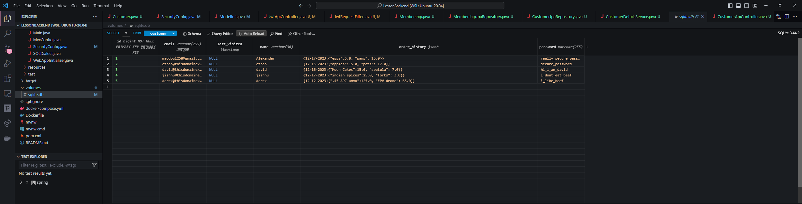
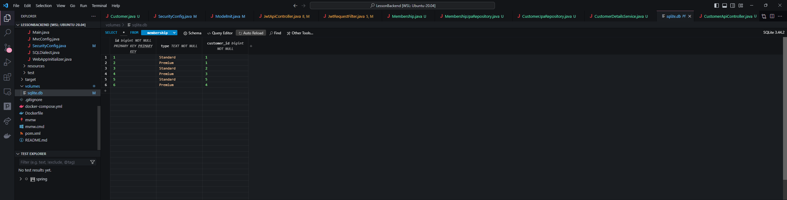

## Collections

### What are collections?
Collections are any group of individual objects that are represented as a single unit is known as a Java Collection of Objects. In Java, a separate framework named the “Collection Framework” has been defined in JDK 1.2 which holds all the Java Collection Classes and Interface in it. It works as an interface that defines the highest-level of shared collection behavior, and extends Iterable which allows usage of ForEach loop.

### Types of Collections

- **List:**  
    - Ordered collection
    - Allows duplicate elements
    - Example: **ArrayList** and **LinkedList**

- **Set:**  
    - Unordered collection 
    - No duplicates
    - Example: **HashSet** and **TreeSet**

- **Map:**  
    - Key-pair values
    - Each key must be unique
    - Example: **HashMap** and **TreeMap**

- **Queue:**  
    - Follows First-In-First-Out order
    - Example: **LinkedList** and **PriorityQueue**

- **Deque:**  
    - Double ended queue
    - Insertion and removal at both ends
    - Example: **ArrayDeque**

### Popcorn Hack!
Come up with a real world example in which collections are used! Write your answer below:
- A queue can be used to store past websites, in order take you back to the previously accessed sites.

## HashMaps 

#### What are they? 

Hash Maps are a **data structure** with keys and values; very similar to a Python dictionary. The keys in Hash Maps have a single value assigned to them, which can be accessed by calling the key: 


```java
import java.util.HashMap;  //Hashmaps are part of the java.util package

public class PlanetDistances {
    public static void main(String[] args) {

        HashMap<String, Double> hashMap = new HashMap<>();

        // key-value pairs, where the key is the planet (a string) and the value is the double assigned to each key
        hashMap.put("Mercury", 0.39);
        hashMap.put("Venus", 0.72); //adding an element
        hashMap.put("Earth", 1.00);
        hashMap.remove("Earth", 1.00); //removing an element

        // the value 0.39 can be accessed by calling the key "Mercury"
        double value = hashMap.get("Mercury");
        boolean exists = hashMap.containsKey("Mercury"); //you can also check if a key exists
        System.out.println("Mercury is " + value + " astronomical units away from the Sun");
    }
}

PlanetDistances.main(null);
```

    Mercury is 0.39 astronomical units away from the Sun


As shown above, the data type of the keys and values must be defined when creating the Hashmap. You cannot use data types for keys or values that are different from the ones assigned to it. Also, keys must be non-null objects. However, values can be null!

<br>

Keys in a Hashmap must be unique. Otherwise the previous values of the key get overwritten.


```java
import java.util.HashMap;  

public class ShoePrices {
    public static void main(String[] args) {

        HashMap<String, Double> hashMap = new HashMap<>();

        hashMap.put("Nike", 41.97);
        hashMap.put("Nike", 80.97); //this value replaces the previous value 
        hashMap.put("Adidas", 69.99);
        hashMap.put("Vans", 55.00);

        double value = hashMap.get("Nike");
        System.out.println("A Nike shoe would cost " + value);
    }
}

ShoePrices.main(null);
```

    A Nike shoe would cost 80.97


#### Popcorn hack: what can we do if we want to assign multiple values to a single key? Do it below!: 
 - Instead, we can store an array, arrayList, or any other collection objects to store multiple values.


```java
import java.util.HashMap;  

public class ShoePrices {
    public static void main(String[] args) {

        HashMap<String, Double> hashMap = new HashMap<>();

        hashMap.put("Nike", 41.97);
        hashMap.put("Nike", 80.97);
        hashMap.put("Adidas", 69.99);
        hashMap.put("Vans", 55.00);

        double value = hashMap.get("Nike");
        System.out.println("A Nike shoe would cost " + value);
    }
}

ShoePrices.main(null);
```

Note that collisions can still occur when two keys produce the same hash code. Hash codes are assigned to each key through a hash function (this is called hashing). They are used to determine what the key-value pair's index should be iwthin the Hashmaps. A bad hash function may cause collisions to occur, in which case the function would need to be adjusted. 

HashMaps do not store the input order of the key-value pairs, and there is no guarantee the pairs will always be stored in the same order. Therefore if something needs to be found within a HashMap, iteration must be used. This can be done through `keySet()`, `values()`, or `entrySet()`


<br>

**keySet()** -- provides access to the set of keys. Useful for if you only need to access keys w/out values 


```java
import java.util.HashMap;
import java.util.Set;

public class OscarWinners {
    public static void main(String[] args) {

        HashMap<String, Integer> oscarWinnersYear = new HashMap<>();

        oscarWinnersYear.put("Nomadland", 2020);
        oscarWinnersYear.put("Parasite", 2019);
        oscarWinnersYear.put("Green Book", 2018);
        oscarWinnersYear.put("The Shape of Water", 2017);

        Set<String> oscarWinners = oscarWinnersYear.keySet(); //using keySet to get keys 

        System.out.println("List of Oscar winners " + oscarWinners);
    }
}

OscarWinners.main(null);
```

    List of Oscar winners [Nomadland, Parasite, Green Book, The Shape of Water]


**values()** -- returns set of values, without any keys 


```java
import java.util.HashMap;
import java.util.Set;

public class OscarWinners {
    public static void main(String[] args) {

        HashMap<String, Integer> oscarWinnersYear = new HashMap<>();

        oscarWinnersYear.put("Nomadland", 2020);
        oscarWinnersYear.put("Parasite", 2019);
        oscarWinnersYear.put("Green Book", 2018);
        oscarWinnersYear.put("The Shape of Water", 2017);

        Collection<Integer> oscarWinnerYears = oscarWinnersYear.values(); //using values to get values 

        System.out.println("Years movies won Oscars " + oscarWinnerYears);
    }
}

OscarWinners.main(null);
```

    Years movies won Oscars [2020, 2019, 2018, 2017]


**entryset()** -- returns keys and values in the form of objects. Useful for when working with key-value pair relationships


```java
import java.util.HashMap;
import java.util.Set;

public class OscarWinners {
    public static void main(String[] args) {

        HashMap<String, Integer> oscarWinnersYear = new HashMap<>();

        oscarWinnersYear.put("Nomadland", 2020);
        oscarWinnersYear.put("Parasite", 2019);
        oscarWinnersYear.put("Green Book", 2018);
        oscarWinnersYear.put("The Shape of Water", 2017);

        Set<Map.Entry<String, Integer>> oscarWinnersAndYears = oscarWinnersYear.entrySet(); //using values to get values 

        System.out.println("Oscars and their years " + oscarWinnersAndYears);
    }
}

OscarWinners.main(null);
```

    Oscars and their years [Nomadland=2020, Parasite=2019, Green Book=2018, The Shape of Water=2017]


HashMaps have a time complexity of O(1) on average!

## HashSet

### What is a hashset?
- A hashset is a data structure that stores only unique values and does not allow duplicates. You can also think of it as a set of keys with no values.  


```java
import java.util.HashSet;
import java.util.Set;

public class Colors{
    static Set<String> colors = new HashSet<>();

    public static void main(String[] args) {
        colors.add("Red");
        colors.add("Blue");
        colors.add("Green");
        System.out.println(colors);
    }
}

Colors.main(null);
```

    [Red, Blue, Green]


### What if we add duplicates?
- If we try add duplicates, the hashset will simply not add the duplicate value and return false as seen bellow. 


```java
public class ColorsButDifferent{
    static Set<String> colors = new HashSet<>();

    public static void main(String[] args) {
        System.out.println(colors.add("Blue"));
        System.out.println(colors.add("Green"));
        System.out.println(colors.add("Green"));
        System.out.println(colors);
    }
}

ColorsButDifferent.main(null);
```

    true
    true
    false
    [Blue, Green]


### Order?
- Hashsets are not ordered and do not store the order in which the values were added that means that if values are removed their order will not be preserved. 


```java
public class Fruits{
    static Set<String> fruits = new HashSet<>();

    public static void main(String[] args) {
        fruits.add("Apple");
        fruits.add("Banana");
        fruits.add("Orange");
        System.out.println(fruits);

        fruits.remove("Banana");

        System.out.println(fruits);
    }
}

Fruits.main(null);
```

    [Apple, Orange, Banana]
    [Apple, Orange]


### How do you know if a value is in a hashset?
- You can use the contains method to check if a value is in a hashset.


```java
public class Fruits{
    static Set<String> fruits = new HashSet<>();

    public static void main(String[] args) {
        fruits.add("Apple");
        fruits.add("Banana");
        fruits.add("Orange");

        System.out.println(fruits.contains("Apple"));
    }
}

Fruits.main(null);
```

    true


### Other methods
- clear() - removes all values from the hashset
- isEmpty() - returns true if the hashset is empty
- size() - returns the number of values in the hashset
- toArray() - returns an array of the values in the hashset


```java
public class Fruits{
    static Set<String> fruits = new HashSet<>();

    public static void main(String[] args) {
        fruits.add("Apple");
        fruits.add("Banana");
        fruits.add("Orange");
        System.out.println(fruits);

        System.out.println();
        System.out.println("Length of Hashmap: " + fruits.size());
        
        System.out.println();
        System.out.println("Array Version of Hashmap: " + fruits.toArray());

        System.out.println();
        fruits.clear();
        System.out.println("Hashmap After Clearing " + fruits);

    }
}

Fruits.main(null);
```

    [Apple, Orange, Banana]
    
    Length of Hashmap: 3
    
    Array Version of Hashmap: [Ljava.lang.Object;@665e264a
    
    Hashmap After Clearing []


### Iterations
- You can iterate through a hashset using a for each loop or an iterator. The order of the values is not guaranteed and can change as values are removed or added.
- These two methods are can be called using the `iterator()` and `forEach()` methods. For the `forEach()` method you can pass in a lambda expression (a lambda expression is an anonymous function) or a method reference.


```java
// foreach loop to iterate through a set

public class Fruits{
    static Set<String> fruits = new HashSet<>();

    public static void main(String[] args) {
        fruits.add("Apple");
        fruits.add("Banana");
        fruits.add("Orange");
        System.out.println(fruits);

        // Using foreach loop to iterate through the set and print each fruit as it goes
        fruits.forEach(fruit -> System.out.println(fruit));
    }
}

Fruits.main(null);

```

    [Apple, Orange, Banana]
    Apple
    Orange
    Banana


```java
// Different version of foreach loop to iterate through a set

public class Cheeses{
    static Set<String> cheeses = new HashSet<>();

    public static void main(String[] args) {
        cheeses.add("Cheddar");
        cheeses.add("Brie");
        cheeses.add("Gouda");
        System.out.println(cheeses);

        cheeses.forEach(cheese -> {
            if(cheese.equals("Brie")) {
                System.out.println("I love " + cheese);
            } else {
                System.out.println("I like " + cheese);
            }
        });
    }
}

Cheeses.main(null);
```

    [Brie, Cheddar, Gouda]
    I love Brie
    I like Cheddar
    I like Gouda


```java
// using iterator to iterate through a set

import java.util.Iterator;

public class Games{
    static Set<String> games = new HashSet<>();

    public static void main(String[] args) {
        games.add("Monopoly");
        games.add("Scrabble");
        games.add("Sorry");
        System.out.println(games);
        System.out.println();

        Iterator<String> iterator = games.iterator();
        while(iterator.hasNext()) {
            System.out.println(iterator.next());
        }
    }
}

Games.main(null);
```

    [Sorry, Monopoly, Scrabble]
    
    Sorry
    Monopoly
    Scrabble


### How to check for equality?
- You can check if two hashsets are equal by using the `equals()` method. This method will return true if the hashsets contain the same values and false if they do not.


```java
public class Pokemon {
    public static void main(String[] args) {
        Set<String> pokemonSet1 = new HashSet<>();
        Set<String> pokemonSet2 = new HashSet<>();

        // Populate the sets
        pokemonSet1.add("Pikachu");
        pokemonSet1.add("Charmander");
        pokemonSet1.add("Pikaman");

        pokemonSet2.add("Pikachu");
        pokemonSet2.add("Charmander");
        pokemonSet2.add("Pikaman");

        // Check equality
        boolean areEqual = pokemonSet1.equals(pokemonSet2);
        System.out.println("Are the sets equal? " + areEqual);
    }
}

Pokemon.main(null);

```

    Are the sets equal? true


### Other kinds of hashsets
- There are other kinds of hashsets that are similar to the hashset but have some differences. These include the linkedhashset and the treeset. 
- The linkedhashset is similar to the hashset but it maintains the order in which the values were added. 
- The treeset is similar to the hashset but it sorts the values in ascending order.


```java
// LinkedHashSet

import java.util.LinkedHashSet;
import java.util.Set;

public class LinkedHashSetExample {
    public static void main(String[] args) {
        Set<String> linkedHashSet = new LinkedHashSet<>();

        // Add elements
        linkedHashSet.add("Pikachu");
        linkedHashSet.add("Charmander");
        linkedHashSet.add("Pikaman");

        // Iterate through the LinkedHashSet
        System.out.println("LinkedHashSet: ");
        linkedHashSet.forEach(pokemon -> System.out.println(pokemon));
        System.out.println();

        linkedHashSet.remove("Pikachu");
        System.out.println("New hashset: " + linkedHashSet);
    }
}

LinkedHashSetExample.main(null);
```

    LinkedHashSet: 
    Pikachu
    Charmander
    Pikaman
    
    New hashset: [Charmander, Pikaman]


```java
// TreeSet
import java.util.Set;
import java.util.TreeSet;

public class TreeSetExample {
    public static void main(String[] args) {
        Set<String> treeSet = new TreeSet<>();

        // Add elements
        treeSet.add("Alberquerque, New Mexico");
        treeSet.add("Pikachu");
        treeSet.add("Charmander");
        treeSet.add("Pikaman");

        // Iterate through the TreeSet
        treeSet.forEach(pokemon -> System.out.println(pokemon));
        // The values for the TreeSet are sorted alphabetically
    }
}

TreeSetExample.main(null);
```

    Alberquerque, New Mexico
    Charmander
    Pikachu
    Pikaman


## SQL

SQL is a programming language focused on managing and manipulating relational (table-based) databases. It acts as the backbone for many of this class's project backends, allowing users to create, read, update and delete data efficiently. To get a better idea of how data is formatted with JPA to be stored in an SQL database, we'll be looking at the `Person` object in the [lesson backend](https://github.com/Tirth-Thakkar/LessonBackend). Follow along in this notebook.

### Person Object Setup

(see .../mvc/person/Person.java)

After the first three tags, which specify to Lombok that `@AllArgsConstructor` and `@NoArgsConstructor` methods should be created

The `@Entity` tag indicates that Person objects will be stored as entities in a database. Generally, entities' attributes are represented by values in columns in the SQLite table.


```java
@Data
@AllArgsConstructor
@NoArgsConstructor
@Entity
@Convert(attributeName ="person", converter = JsonType.class)
public class Person //...
```

The `@Id` tag specifies to that this value will be used as the unique identifier for each object in the database, and `@GeneratedValue(strategy = GenerationType.AUTO)` allows these ID's to be automatically generated when a new Person is created. In order for data to be most easily differentiated and manipulated in a database, IDs are deeply important to use.


```java
@Id
@GeneratedValue(strategy = GenerationType.AUTO)
private Long id;
```

### Person JPA Repository Setup

(see .../mvc/person/PersonJpaRepository.java)

JPA is a great asset when creating an SQL database because it can provide methods that help you modify its contents. If a specific object has a `JpaRepository` interface made that extends the base JPA repository, it allows you to access many useful JPA methods.


```java
import org.springframework.data.jpa.repository.JpaRepository;
import org.springframework.data.jpa.repository.Query;

// ...

public interface PersonJpaRepository extends JpaRepository<Person, Long> // ...
```

#### Popcorn Hack!

List all of the JPA methods that you see in the PersonJpaRepository.java file and what their purpose is.
- `findByEmail`: Finds a person object in the database based on their email
- `findAllByOrderByNameAsc`: Lists all users in the database in ascending order of their names
- `findByNameContainingIgnoreCaseOrEmailContainingIgnoreCase`: Finds a person based on their name or email (case-insensitive)
- `findByEmailAndPassword`: Locates a user based on a given email and password
- `findByLikeTermNative`: Locates a user based on a common/shared term. Customized using `@Query`

#### Custom JPA Queries

You can create custom JPA queries that utilize SQL to serve a specific purpose outside of the existing JPA methods. See the example below from PersonJpaRepository.java:


```java
@Query(
        value = "SELECT * FROM Person p WHERE p.name LIKE ?1 or p.email LIKE ?1",
        nativeQuery = true)
List<Person> findByLikeTermNative(String term);
```

Going step-by-step:
- The `@Query` indicates a custom query is being created
- `value` is a String containing an SQL query that will be run with the method `findByLikeTermNative`
    - `?1` is a placeholder for a parameter (in this case the String `term` from the method declaration)
- `nativeQuery` is set to true, indicating that the value uses native SQL rather than JPQL (Java Persistence Query Language)

Using a custom SQL query like this would be a great way to show understanding on the homework.

### Many-to-Many Relationship

(see .../mvc/person/Person.java)

A "Many-to-Many" relationship (shown in the @ManyToMany tag) indicates that entities on both sides of a relationship can have multiple connections with each other.

This condition allows for one object to be related to multiple different objects, and those different objects on the other side of the relationship can have their own relationship to other objects.


```java
@ManyToMany(fetch = EAGER)
private Collection<PersonRole> roles = new ArrayList<>();
```

(fetch = EAGER) specifies that, whenever a `Person` object is loaded, its corresponding `PersonRole` objects should be loaded simultaneously.

Objects in a "many-to-many" relationship often use "join tables" to represent the connections between these objects.

```text
| person_id | role_id |
|-----------|---------|
| 1         | 1       |
| 1         | 2       |
| 2         | 2       |
| 3         | 1       |
| 3         | 3       |
```

This is what a "join table" may look like with multiple interconnected people and roles. There is a table in the backend repository's SQLite.db called `person_roles` that acts as a join table for the two roles, but you'll notice that it's empty. If you can show it filled up, that sounds like a good reason to give extra points.

#### Popcorn Hack!

Explain in your own words what the relationship between `Person` objects and `PersonRole` objects is. Why is this relevant to collections? (Hint: In the code above, multiple `PersonRole` objects are stored within a `Person` object's roles attribute.)
 - The `Person` object may represent a user of our application, and `PersonRole` could resemble a certain privilege level (like admins vs standard users) or perhaps different groups/cliches of users. This is relevant to collections because its a means of storing data that are close in use and similarity to one another to ensure smooth running of our program.

### Many-to-One Relationship

On the other hand, there is also a "Many-to-One" relationship that can exist between two objects. It means that multiple instances of one entity (the "many" side) are associated with a single instance of another entity (the "one" side). This can be seen applied to the `Note` object in relation to the `Person` object.


```java
@ManyToOne(fetch = FetchType.LAZY, optional = false)
@JoinColumn(name = "tutorial_id", nullable = false) // notice this!
@OnDelete(action = OnDeleteAction.CASCADE)
@JsonIgnore
private Person person;
```

Notice the `@JoinColumn(name = "tutorial_id", nullable = false)` tag. Then, check the `note` table in the sqlite.db file.

#### Popcorn Hack!

Where do you see "tutorial_id" on the table? What does it represent in relation to the leftmost "id" column?
 - I see `tutorial_id` in the `note` table next to the text column which appears to store a string of text and an associated email. The tutorial `id` appears to be relating to a given user ID within the `person` table 

### Storing HashMaps with jsonb

JSONB is a binary representation of JSON data. It is a data type used in some relational databases (such as SQL databases) to store JSON documents in a more efficient and flexible way compared to traditional JSON. Within SQL databases, this data from the JSON can often be filtered, searched and/or extracted using provided functions.


```java
@JdbcTypeCode(SqlTypes.JSON)
@Column(columnDefinition = "jsonb")
private Map<String,Map<String, Object>> stats = new HashMap<>(); 
```

JSONB allows for the storage of nested and dynamic data structures. In the context of `Person` object stats, it means that each person can store activity data with the formatted date as the key, and the structure of this JSON data can be modified or extended without altering the database schema.

You can view the way this data is structured in the `person` sqlite.db table.

## Homework

- Complete all popcorn hacks throughout this lesson
- Using the [Person](https://github.com/Tirth-Thakkar/LessonBackend/tree/master/src/main/java/com/nighthawk/spring_portfolio/mvc/person) object as inspiration, create your own UNIQUE SQL database with at least 3 object entries that incorporates either a "many-to-many" relationship with another object (hint: Person and PersonRole) OR uses the JSONB column definition to store more complex data (such as a HashMap) as an attribute (hint: stats in Person object).
    - Show a clear screenshot of your SQLite table (using SQLite viewer) on your blog for credit.
    - Using past group project materials is valid for this homework as long as the expectations are met.

Main Customers Table:
  
Many-to-Many Memberships Table:
  
## As you can see, both Many to Many and JSONB were implemented, now give me the points

### Ideas for 1.0/1.0

- Incorporating both a "many-to-many" relationship and a JSONB column with information would be great.
- Implementing JPA repository methods (think CRUD methods, custom queries, etc.) would show interest in modifying SQL database data.
- Take extra notes on this lesson that show deeper research into Collections and SQL.
