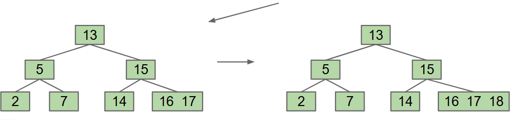

# BST Tree Height
- Trees range from a best case of being "bushy" to worst-case being "spindly".
    - Bushy trees minimize the height to around log(N) where N is the number of nodes in the tree.
    - Spindly trees maximize the height to around N where N is the number of nodes in the tree.
- Bushy trees have height belonging to $\Theta(\log N)$ while spindly trees have $\Theta(N)$
    - A spindly tree is close to a linked list.
- Big O is often used as a short hand for "worst case", but really, people mean the worst case runtime is $\Theta(something)$
    - Ex: BST heights are O(N^2) but aren't necessarily quadratic in the worst case.

# BST properties
- The height and average depth are important properties of BSTs are important,
    - The **depth** of a node is how far it is from the root
    - The **height** of a tree is the depth of the deppest node.
    - The **average depth** of a tree is the average depth of its nodes.
- The **height** of a tree represents the worst case runtime to find a node
- The **average depth** of a tree represents the average case runtie to find a node.
- We reach the worst case height of **N** when we add sequentially larger elements.
    - However, this is not likely to happen.

>Random Inserts: Random trees made from random inserts have $\Theta(\log N)$ average depth and height. Random trees are bushy and not spindly.

- However, we can't always insert our items in a random order.
    - Data comes in over time, so we don't have all of them at once.
    - Time stamps are stored in increasing order as they come in. This would result in a height $N$ tree!
    - We cannot rely on random input.

### Avoiding Imbalance.
- The main problem with the worst case situation is adding new leaves at the bottom.
    - What if we never added new leaves at the bottom?
    - We can overstuff the existing leaf nodes, by storing multiple values in a node.
- A solution could be a limit on the number of items that each node can store. Call this limit L.
    - If any node has more than L items, we give an item to the parent.
    - We can arbitrarily select the left-middle.
        - However this causes a problem. We move the left middle up, but we can end up with a value smaller than the left middle in a node to the right of the left middle.
        
        - We may just split the node into two nodes. in the example above, 16 would just become its own node.
        

## Chain Reaction Spltting
- Once a parent node gets too full, we split it and form another tree.
- The left half children goes to the left subtree, and the right half children goes to th eright subtree.
- If a root node gets too full, we take the left middle element and make that the new root node, with the split tree as its children.
- In both cases, we maintain that all nodes in the left sub-tree is smaller than the parent, and all nodes in the right sub-tree is greater tha nthe parent.

## Balance
- Splitting (B-Trees) trees have perfect balance,
- If we split the root, every node gets pushed down by one level.
- If a leaf node is split, the height doesn't change.
- All operations are guaranteed to have $O(\log N)$ time.

## Uses
- B-Tree with small L are used as a simple balanced search tree.
- B-Tree with large L represents databases and filesystems with very large records.
- No matter the insertion order a B-Tree is always bushy.
- B-Trees have two nice invariants
    - All leaves must be the same distance from the root
    - A non-leaf node with k items must have exactly k+1 children.

## B-Tree runtime for `contains`
- The worst case number of nodes to inspect is **H+1**
- The worst case number of items to inspect per node is **L**
- The overall runtime is $O(HL)$
    - H = $\Theta(\log N)$
    - runtime is $O(L \log N)$
